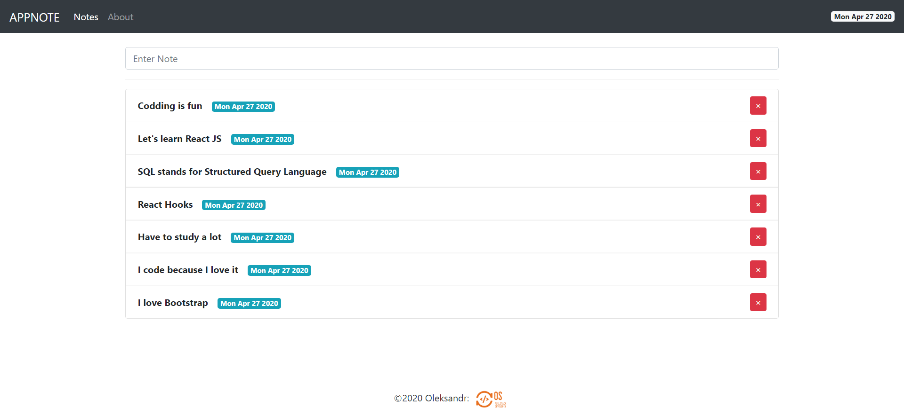

# Simple-React-Notes-App-with-Firebase
***

***
## Setup
> __Note:__ in order to run this Application, you will have to [create a Firebase Database](https://firebase.google.com/docs/database/web/start "Create a Database").
1. Download
2. Run it through the VS Code.
   1. Open src/context/firebase/__FirebaseState.js__ file.
   2. In ```javascript 
            const URL = 'YOUR LINK TO FIREBASE DATABSE'; 
         ```
```javascript
const s = "JavaScript syntax highlighting";
alert(s);
```
